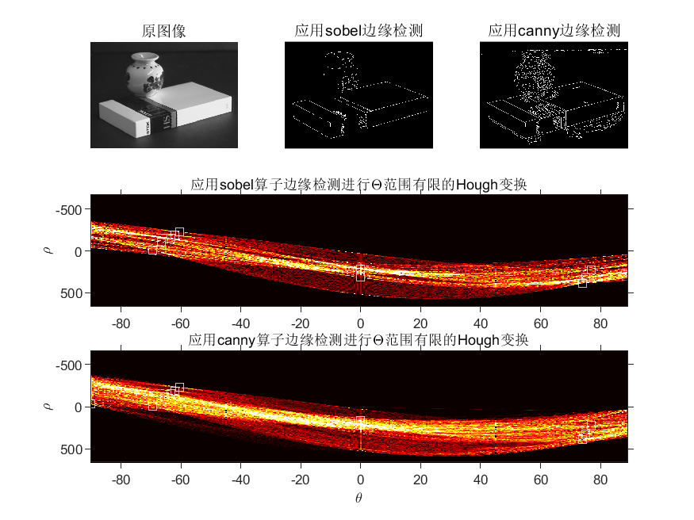

数字图像处理第七次实验报告

自动化64    

 2160504108 

  赵毅

摘要

   第七次作业为直线检测，使用MATLAB对所给留个图像文件的处理：首先对测试图像（文件名为：test1~test6）进行边缘检测，分别采用Sobel等模板和cann算子方法；对图像进行处理。在边缘检测的基础上，用hough变换检测图中直线；比较不同边缘检测算法性能差异、比较不同hough变换参数对直线检测的影响。

***1. 首先对测试图像（文件名为：test1~test6）进行边缘检测，可采用书上介绍的Sobel等模板或者canny算子方法***    

  **Sobel**  

 Sobel算子是像素图像边缘检测中最重要的算子之一，在机器学习、数字媒体、计算机视觉等信息科技领域起着举足轻重的作用。在技术上，它是一个离散的一阶差分算子，用来计算图像亮度函数的一阶梯度之近似值。在图像的任何一点使用此算子，将会产生该点对应的梯度矢量或是其法矢量。
 sobel算子的思想，Sobel算子认为，邻域的像素对当前像素产生的影响不是等价的，所以距离不同的像素具有不同的权值，对算子结果产生的影响也不同。一般来说，距离越远，产生的影响越小。sobel算子的原理，对传进来的图像像素做卷积，卷积的实质是在求梯度值，或者说给了一个加权平均，其中权值就是所谓的卷积核；然后对生成的新像素灰度值做阈值运算，以此来确定边缘信息。

  **Canny**  
Canny的目标是找到一个最优的边缘检测算法，最优边缘检测的含义是：好的检测 - 算法能够尽可能多地标识出图像中的实际边缘。好的定位 - 标识出的边缘要与实际图像中的实际边缘尽可能接近。最小响应 - 图像中的边缘只能标识一次，并且可能存在的图像噪声不应标识为边缘。为了满足这些要求Canny使用了变分法，这是一种寻找满足特定功能的函数的方法。最优检测使用四个指数函数项的和表示，但是它非常近似于高斯函数的一阶导数。 Canny算法包含许多可以调整的参数，它们将影响到算法的计算的时间与实效。高斯滤波器的大小：第一步所用的平滑滤波器将会直接影响Canny算法的结果。较小的滤波器产生的模糊效果也较少，这样就可以检测较小、变化明显的细线。较大的滤波器产生的模糊效果也较多，将较大的一块图像区域涂成一个特定点的颜色值。这样带来的结果就是对于检测较大、平滑的边缘更加有用，例如彩虹的边缘。阈值：使用两个阈值比使用一个阈值更加灵活，但是它还是有阈值存在的共性问题。设置的阈值过高，可能会漏掉重要信息；阈值过低，将会把枝节信息看得很重要。很难给出一个适用于所有图像的通用阈值。目前还没有一个经过验证的实现方法。

*** 2、在边缘检测的基础上，用hough变换检测图中直线 ***  
Hough变换是一种使用表决原理的参数估计技术。其原理是利用图像空间和Hough参数空间的点－线对偶性，把图像空间中的检测问题转换到参数空间。  
先进行边缘检测，之后利用其进行Hough变换。  
1、Hough函数  
首先通过Hough函数选择直线检测的角度参数，生成H、theta、rho三个直线检测所需的参数  
2、HoughPeaks  
通过Houghpeaks函数检测峰值，通过峰值的个数来决定直线的条数。  
3、HoughLines  
最后将H、theta、rho、peak三个参数填入HoughLines函数，生成直线在图像矩阵的位置坐标。  
最后按照坐标的值在原图像中进行描出即可。  

**实验结果**  
所有图像从左到右为原图像、Sobel算子、Canny算子  

*****Sobel与Canny比较*****  
从实验的处理结果来看，Canny算子对边缘的检测能力要优于Sobel算子，它对图像细节的提取更加精确，但是也可能包含一些不需要的信息，而Sobel算子对一些较为复杂的图像处理则非常粗糙。
但是运算速度较快适合于计算。

* 

***test1*********不同Hough变换参数的比较******  
1、 峰值的个数不同会改变直线的个数   
本文取

2、 检测角度的不同会检测出不同角度的直线  
如角度间隔分别为0.2和2时，：  前面六个为sobel算子结果 后面六个为canny结果

下面为30条直线的结果展示

对于角度参数变换产生的影响是直线的角度不同。本次作业设定角度范围将

'Theta',-90:0.5:89全部展示。

附录代码展示

clear;
clc;

[pi1,map1]= imread('test1.bmp');
[pi2,map2]= imread('test2.png');
[pi3,map3]= imread('test3.jpg');
[pi4,map4]= imread('test4.bmp');
[pi5,map5]= imread('test5.png');
[pi6,map6]= imread('test6.jpg');

out1=edge(pi1,'Sobel');
out2=edge(pi2,'Sobel');
out3=edge(pi3,'Sobel');
out4=edge(pi4,'Sobel');
out5=edge(pi5,'Sobel');
out6=edge(pi6,'Sobel');

out11=edge(pi1,'canny');
out12=edge(pi2,'canny');
out13=edge(pi3,'canny');
out14=edge(pi4,'canny');
out15=edge(pi5,'canny');
out16=edge(pi6,'canny');

[H1,T1,R1] = hough(out1,'RhoResolution',0.5,'Theta',-90:0.5:89);
[H2,T2,R2] = hough(out2,'RhoResolution',0.5,'Theta',-90:0.5:89);
[H3,T3,R3] = hough(out3,'RhoResolution',0.5,'Theta',-90:0.5:89);
[H4,T4,R4] = hough(out4,'RhoResolution',0.5,'Theta',-90:0.5:89);
[H5,T5,R5] = hough(out5,'RhoResolution',0.5,'Theta',-90:0.5:89);
[H6,T6,R6] = hough(out6,'RhoResolution',0.5,'Theta',-90:0.5:89);

[H11,T11,R11] = hough(out11,'RhoResolution',0.5,'Theta',-90:0.5:89);
[H12,T12,R12] = hough(out12,'RhoResolution',0.5,'Theta',-90:0.5:89);
[H13,T13,R13] = hough(out13,'RhoResolution',0.5,'Theta',-90:0.5:89);
[H14,T14,R14] = hough(out14,'RhoResolution',0.5,'Theta',-90:0.5:89);
[H15,T15,R15] = hough(out15,'RhoResolution',0.5,'Theta',-90:0.5:89);
[H16,T16,R16] = hough(out16,'RhoResolution',0.5,'Theta',-90:0.5:89);
P1  = houghpeaks(H1,20);
P2  = houghpeaks(H2,20);
P3  = houghpeaks(H3,20);
P4  = houghpeaks(H4,20);
P5  = houghpeaks(H5,20);
P6  = houghpeaks(H6,20);
P11  = houghpeaks(H11,20);
P12  = houghpeaks(H12,20);
P13  = houghpeaks(H13,20);
P14  = houghpeaks(H14,20);
P15  = houghpeaks(H15,20);
P16  = houghpeaks(H16,20);

figure;
subplot(3,3,1) 
imshow(pi1);
title('原图像')
subplot(3,3,2) 
imshow(out1);
title('应用sobel边缘检测')
subplot(3,3,3) 
imshow(out11);
title('应用canny边缘检测')
subplot(3,3,[4,5,6])
imshow(imadjust(rescale(H1)),'XData',T1,'YData',R1,...
   'InitialMagnification','fit');
title('应用sobel算子边缘检测进行\Theta范围有限的Hough变换');
% xlabel('\theta')
ylabel('\rho');
axis on, axis normal;
colormap(gca,hot)
hold on;
plot(T1(P1(:,2)),R1(P1(:,1)),'s','color','white');

subplot(3,3,[7,8,9])
imshow(imadjust(rescale(H11)),'XData',T11,'YData',R11,...
   'InitialMagnification','fit');
title('应用canny算子边缘检测进行\Theta范围有限的Hough变换');
xlabel('\theta')
ylabel('\rho');
axis on, axis normal;
colormap(gca,hot)
hold on;
plot(T11(P11(:,2)),R11(P11(:,1)),'s','color','white');
saveas(gcf, '1.png');

figure;
subplot(3,3,1) 
imshow(pi2);
title('原图像')
subplot(3,3,2) 
imshow(out2);
title('应用sobel边缘检测')
subplot(3,3,3) 
imshow(out12);
title('应用canny边缘检测')
subplot(3,3,[4,5,6])
imshow(imadjust(rescale(H2)),'XData',T2,'YData',R2,...
   'InitialMagnification','fit');
title('应用sobel算子边缘检测进行\Theta范围有限的Hough变换');
% xlabel('\theta')
ylabel('\rho');
axis on, axis normal;
colormap(gca,hot)
hold on;
plot(T2(P2(:,2)),R2(P2(:,1)),'s','color','white');
subplot(3,3,[7,8,9])
imshow(imadjust(rescale(H12)),'XData',T12,'YData',R12,...
   'InitialMagnification','fit');
title('应用canny算子边缘检测进行\Theta范围有限的Hough变换');
xlabel('\theta')
ylabel('\rho');
axis on, axis normal;
colormap(gca,hot)
hold on;
plot(T12(P12(:,2)),R12(P12(:,1)),'s','color','white');
saveas(gcf, '2.png');

figure;
subplot(3,3,1) 
imshow(pi3);
title('原图像')
subplot(3,3,2) 
imshow(out3);
title('应用sobel边缘检测')
subplot(3,3,3) 
imshow(out13);
title('应用canny边缘检测')
subplot(3,3,[4,5,6])
imshow(imadjust(rescale(H3)),'XData',T3,'YData',R3,...
   'InitialMagnification','fit');
title('应用sobel算子边缘检测进行\Theta范围有限的Hough变换');
% xlabel('\theta')
ylabel('\rho');
axis on, axis normal;
colormap(gca,hot)
hold on;
plot(T3(P3(:,2)),R3(P3(:,1)),'s','color','white');
subplot(3,3,[7,8,9])
imshow(imadjust(rescale(H13)),'XData',T13,'YData',R13,...
   'InitialMagnification','fit');
title('应用canny算子边缘检测进行\Theta范围有限的Hough变换');
xlabel('\theta')
ylabel('\rho');
axis on, axis normal;
colormap(gca,hot)
hold on;
plot(T13(P13(:,2)),R13(P13(:,1)),'s','color','white');
saveas(gcf, '3.png');

figure;
subplot(3,3,1) 
imshow(pi4);
title('原图像')
subplot(3,3,2) 
imshow(out4);
title('应用sobel边缘检测')
subplot(3,3,3) 
imshow(out14);
title('应用canny边缘检测')
subplot(3,3,[4,5,6])
imshow(imadjust(rescale(H4)),'XData',T4,'YData',R4,...
   'InitialMagnification','fit');
title('应用sobel算子边缘检测进行\Theta范围有限的Hough变换');
% xlabel('\theta')
ylabel('\rho');
axis on, axis normal;
colormap(gca,hot)
hold on;
plot(T4(P4(:,2)),R4(P4(:,1)),'s','color','white');
subplot(3,3,[7,8,9])
imshow(imadjust(rescale(H14)),'XData',T14,'YData',R14,...
   'InitialMagnification','fit');
title('应用canny算子边缘检测进行\Theta范围有限的Hough变换');
xlabel('\theta')
ylabel('\rho');
axis on, axis normal;
colormap(gca,hot)
hold on;
plot(T14(P14(:,2)),R14(P14(:,1)),'s','color','white');
saveas(gcf, '4.png');

figure;
subplot(3,3,1) 
imshow(pi5);
title('原图像')
subplot(3,3,2) 
imshow(out5);
title('应用sobel边缘检测')
subplot(3,3,3) 
imshow(out15);
title('应用canny边缘检测')
subplot(3,3,[4,5,6])
imshow(imadjust(rescale(H5)),'XData',T5,'YData',R5,...
   'InitialMagnification','fit');
title('应用sobel算子边缘检测进行\Theta范围有限的Hough变换');
% xlabel('\theta')
ylabel('\rho');
axis on, axis normal;
colormap(gca,hot)
hold on;
plot(T5(P5(:,2)),R5(P5(:,1)),'s','color','white');
subplot(3,3,[7,8,9])
imshow(imadjust(rescale(H15)),'XData',T15,'YData',R15,...
   'InitialMagnification','fit');
title('应用canny算子边缘检测进行\Theta范围有限的Hough变换');
xlabel('\theta')
ylabel('\rho');
axis on, axis normal;
colormap(gca,hot)
hold on;
plot(T15(P15(:,2)),R15(P15(:,1)),'s','color','white');

saveas(gcf, '5.png');

figure;
subplot(3,3,1) 
imshow(pi6);
title('原图像')
subplot(3,3,2) 
imshow(out6);
title('应用sobel边缘检测')
subplot(3,3,3) 
imshow(out16);
title('应用canny边缘检测')
subplot(3,3,[4,5,6])
imshow(imadjust(rescale(H6)),'XData',T6,'YData',R6,...
   'InitialMagnification','fit');
title('应用sobel算子边缘检测进行\Theta范围有限的Hough变换');
% xlabel('\theta')
ylabel('\rho');
axis on, axis normal;
colormap(gca,hot)
hold on;
plot(T6(P6(:,2)),R6(P6(:,1)),'s','color','white');

subplot(3,3,[7,8,9])
imshow(imadjust(rescale(H16)),'XData',T16,'YData',R16,...
   'InitialMagnification','fit');
title('应用canny算子边缘检测进行\Theta范围有限的Hough变换');
xlabel('\theta')
ylabel('\rho');
axis on, axis normal;
colormap(gca,hot)
hold on;
plot(T16(P16(:,2)),R16(P16(:,1)),'s','color','white');

saveas(gcf, '6.png');

figure 
BW=out1;T=T1;R=R1;P=P1;rotI=pi1;
lines = houghlines(BW,T,R,P,'FillGap',5,'MinLength',7);
 imshow(rotI), hold on
max_len = 0;
for k = 1:length(lines)
   xy = [lines(k).point1; lines(k).point2];
   plot(xy(:,1),xy(:,2),'LineWidth',2,'Color','green');

   % Plot beginnings and ends of lines
   plot(xy(1,1),xy(1,2),'x','LineWidth',2,'Color','yellow');
   plot(xy(2,1),xy(2,2),'x','LineWidth',2,'Color','red');

   % Determine the endpoints of the longest line segment
   len = norm(lines(k).point1 - lines(k).point2);
   if ( len > max_len)
      max_len = len;
      xy_long = xy;
   end
end
saveas(gcf, 'sobel1.png');
figure 
BW=out11;T=T11;R=R11;P=P11;rotI=pi1;
lines = houghlines(BW,T,R,P,'FillGap',5,'MinLength',7);
 imshow(rotI), hold on
max_len = 0;
for k = 1:length(lines)
   xy = [lines(k).point1; lines(k).point2];
   plot(xy(:,1),xy(:,2),'LineWidth',2,'Color','green');

   % Plot beginnings and ends of lines
   plot(xy(1,1),xy(1,2),'x','LineWidth',2,'Color','yellow');
   plot(xy(2,1),xy(2,2),'x','LineWidth',2,'Color','red');

   % Determine the endpoints of the longest line segment
   len = norm(lines(k).point1 - lines(k).point2);
   if ( len > max_len)
      max_len = len;
      xy_long = xy;
   end
end
saveas(gcf, 'canny1.png');

figure 
BW=out2;T=T2;R=R2;P=P2;rotI=pi2;
lines = houghlines(BW,T,R,P,'FillGap',5,'MinLength',7);
 imshow(rotI), hold on
max_len = 0;
for k = 1:length(lines)
   xy = [lines(k).point1; lines(k).point2];
   plot(xy(:,1),xy(:,2),'LineWidth',2,'Color','green');

   % Plot beginnings and ends of lines
   plot(xy(1,1),xy(1,2),'x','LineWidth',2,'Color','yellow');
   plot(xy(2,1),xy(2,2),'x','LineWidth',2,'Color','red');

   % Determine the endpoints of the longest line segment
   len = norm(lines(k).point1 - lines(k).point2);
   if ( len > max_len)
      max_len = len;
      xy_long = xy;
   end
end
saveas(gcf, 'sobel2.png');
figure 
BW=out12;T=T12;R=R12;P=P12;rotI=pi2;
lines = houghlines(BW,T,R,P,'FillGap',5,'MinLength',7);
 imshow(rotI), hold on
max_len = 0;
for k = 1:length(lines)
   xy = [lines(k).point1; lines(k).point2];
   plot(xy(:,1),xy(:,2),'LineWidth',2,'Color','green');

   % Plot beginnings and ends of lines
   plot(xy(1,1),xy(1,2),'x','LineWidth',2,'Color','yellow');
   plot(xy(2,1),xy(2,2),'x','LineWidth',2,'Color','red');

   % Determine the endpoints of the longest line segment
   len = norm(lines(k).point1 - lines(k).point2);
   if ( len > max_len)
      max_len = len;
      xy_long = xy;
   end
end
saveas(gcf, 'canny2.png');

figure 
BW=out3;T=T3;R=R3;P=P3;rotI=pi3;
lines = houghlines(BW,T,R,P,'FillGap',5,'MinLength',7);
 imshow(rotI), hold on
max_len = 0;
for k = 1:length(lines)
   xy = [lines(k).point1; lines(k).point2];
   plot(xy(:,1),xy(:,2),'LineWidth',2,'Color','green');

   % Plot beginnings and ends of lines
   plot(xy(1,1),xy(1,2),'x','LineWidth',2,'Color','yellow');
   plot(xy(2,1),xy(2,2),'x','LineWidth',2,'Color','red');

   % Determine the endpoints of the longest line segment
   len = norm(lines(k).point1 - lines(k).point2);
   if ( len > max_len)
      max_len = len;
      xy_long = xy;
   end
end
saveas(gcf, 'sobel3.png');
figure 
BW=out13;T=T1;R=R13;P=P13;rotI=pi3;
lines = houghlines(BW,T,R,P,'FillGap',5,'MinLength',7);
 imshow(rotI), hold on
max_len = 0;
for k = 1:length(lines)
   xy = [lines(k).point1; lines(k).point2];
   plot(xy(:,1),xy(:,2),'LineWidth',2,'Color','green');

   % Plot beginnings and ends of lines
   plot(xy(1,1),xy(1,2),'x','LineWidth',2,'Color','yellow');
   plot(xy(2,1),xy(2,2),'x','LineWidth',2,'Color','red');

   % Determine the endpoints of the longest line segment
   len = norm(lines(k).point1 - lines(k).point2);
   if ( len > max_len)
      max_len = len;
      xy_long = xy;
   end
end
saveas(gcf, 'canny3.png');

figure 
BW=out4;T=T4;R=R4;P=P4;rotI=pi4;
lines = houghlines(BW,T,R,P,'FillGap',5,'MinLength',7);
 imshow(rotI), hold on
max_len = 0;
for k = 1:length(lines)
   xy = [lines(k).point1; lines(k).point2];
   plot(xy(:,1),xy(:,2),'LineWidth',2,'Color','green');

   % Plot beginnings and ends of lines
   plot(xy(1,1),xy(1,2),'x','LineWidth',2,'Color','yellow');
   plot(xy(2,1),xy(2,2),'x','LineWidth',2,'Color','red');

   % Determine the endpoints of the longest line segment
   len = norm(lines(k).point1 - lines(k).point2);
   if ( len > max_len)
      max_len = len;
      xy_long = xy;
   end
end
saveas(gcf, 'sobel4.png');
figure 
BW=out14;T=T14;R=R14;P=P14;rotI=pi4;
lines = houghlines(BW,T,R,P,'FillGap',5,'MinLength',7);
 imshow(rotI), hold on
max_len = 0;
for k = 1:length(lines)
   xy = [lines(k).point1; lines(k).point2];
   plot(xy(:,1),xy(:,2),'LineWidth',2,'Color','green');

   % Plot beginnings and ends of lines
   plot(xy(1,1),xy(1,2),'x','LineWidth',2,'Color','yellow');
   plot(xy(2,1),xy(2,2),'x','LineWidth',2,'Color','red');

   % Determine the endpoints of the longest line segment
   len = norm(lines(k).point1 - lines(k).point2);
   if ( len > max_len)
      max_len = len;
      xy_long = xy;
   end
end
saveas(gcf, 'canny4.png');
figure 
BW=out5;T=T5;R=R5;P=P5;rotI=pi5;
lines = houghlines(BW,T,R,P,'FillGap',5,'MinLength',7);
 imshow(rotI), hold on
max_len = 0;
for k = 1:length(lines)
   xy = [lines(k).point1; lines(k).point2];
   plot(xy(:,1),xy(:,2),'LineWidth',2,'Color','green');

   % Plot beginnings and ends of lines
   plot(xy(1,1),xy(1,2),'x','LineWidth',2,'Color','yellow');
   plot(xy(2,1),xy(2,2),'x','LineWidth',2,'Color','red');

   % Determine the endpoints of the longest line segment
   len = norm(lines(k).point1 - lines(k).point2);
   if ( len > max_len)
      max_len = len;
      xy_long = xy;
   end
end
saveas(gcf, 'sobel5.png');
figure 
BW=out15;T=T15;R=R15;P=P15;rotI=pi5;
lines = houghlines(BW,T,R,P,'FillGap',5,'MinLength',7);
 imshow(rotI), hold on
max_len = 0;
for k = 1:length(lines)
   xy = [lines(k).point1; lines(k).point2];
   plot(xy(:,1),xy(:,2),'LineWidth',2,'Color','green');

   % Plot beginnings and ends of lines
   plot(xy(1,1),xy(1,2),'x','LineWidth',2,'Color','yellow');
   plot(xy(2,1),xy(2,2),'x','LineWidth',2,'Color','red');

   % Determine the endpoints of the longest line segment
   len = norm(lines(k).point1 - lines(k).point2);
   if ( len > max_len)
      max_len = len;
      xy_long = xy;
   end
end
saveas(gcf, 'canny5.png');
figure 
BW=out6;T=T6;R=R6;P=P6;rotI=pi6;
lines = houghlines(BW,T,R,P,'FillGap',5,'MinLength',7);
 imshow(rotI), hold on
max_len = 0;
for k = 1:length(lines)
   xy = [lines(k).point1; lines(k).point2];
   plot(xy(:,1),xy(:,2),'LineWidth',2,'Color','green');

   % Plot beginnings and ends of lines
   plot(xy(1,1),xy(1,2),'x','LineWidth',2,'Color','yellow');
   plot(xy(2,1),xy(2,2),'x','LineWidth',2,'Color','red');

   % Determine the endpoints of the longest line segment
   len = norm(lines(k).point1 - lines(k).point2);
   if ( len > max_len)
      max_len = len;
      xy_long = xy;
   end
end
saveas(gcf, 'sobel6.png');
figure 
BW=out16;T=T16;R=R16;P=P16;rotI=pi6;
lines = houghlines(BW,T,R,P,'FillGap',5,'MinLength',7);
 imshow(rotI), hold on
max_len = 0;
for k = 1:length(lines)
   xy = [lines(k).point1; lines(k).point2];
   plot(xy(:,1),xy(:,2),'LineWidth',2,'Color','green');

   % Plot beginnings and ends of lines
   plot(xy(1,1),xy(1,2),'x','LineWidth',2,'Color','yellow');
   plot(xy(2,1),xy(2,2),'x','LineWidth',2,'Color','red');

   % Determine the endpoints of the longest line segment
   len = norm(lines(k).point1 - lines(k).point2);
   if ( len > max_len)
      max_len = len;
      xy_long = xy;
   end
end
saveas(gcf, 'canny6.png');
